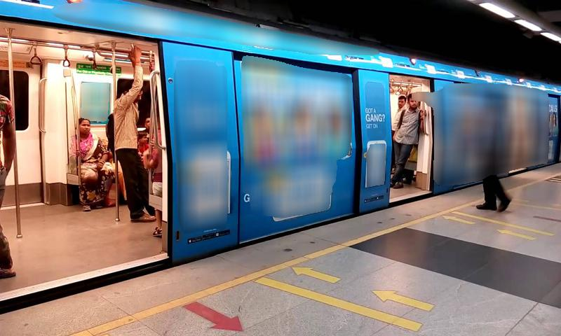
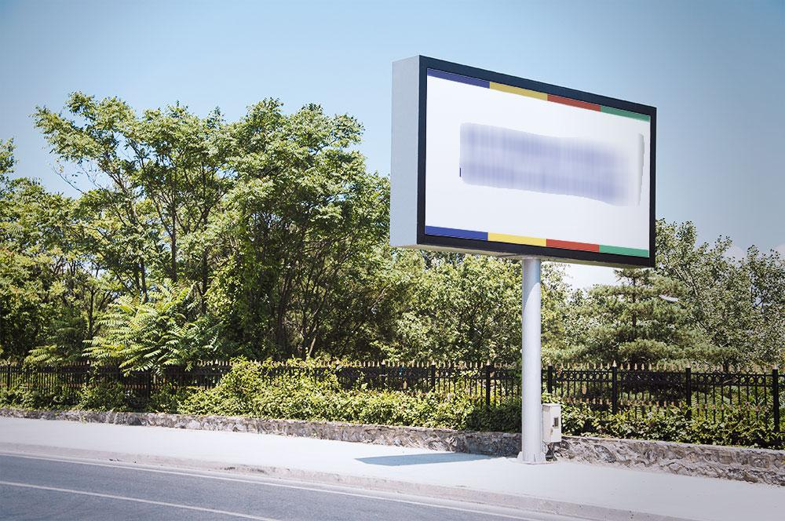
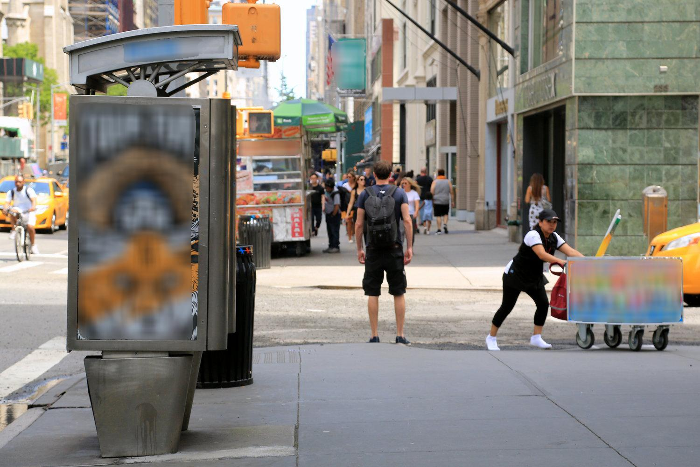
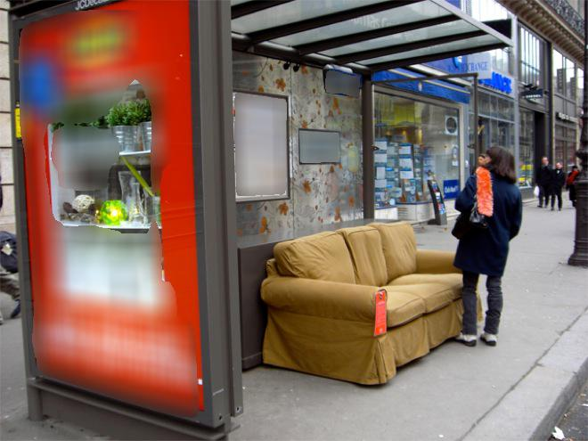
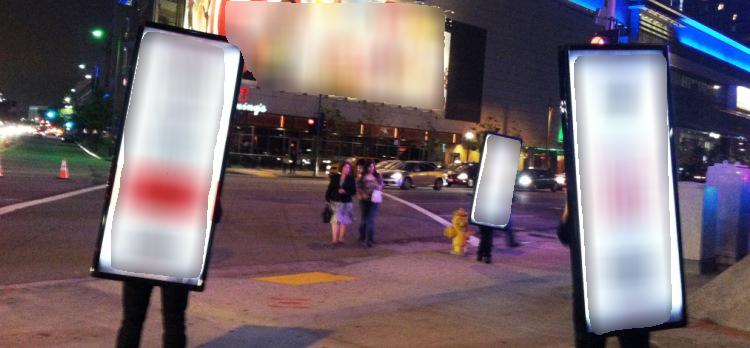

This is MaskRCNN model trained for blurring advertising on the streets. From https://github.com/matterport/Mask_RCNN.git

# Examples
<p align="center">
  
  
  
  
  
  
  
</p>
<p align="center">
  [Video](https://www.youtube.com/watch?v=xQUpQzeStmQ)
  
</p>


# Getting Started
* [blur.py](blur.py) Using a model pre-trained on custom dataset to segment and blur objects in your own images or video.
```
# Detect and blur image or video

python3 blur.py (--image_path=/path/to/image.jpg | --video_path=/path/to/video.mp4) --model=/path/to/weigth.h5 
```
* You can download [dataset annotation](https://github.com/WannaFIy/mask_AD/releases) to train your own model, the dataset consists of photos from Google street view. [dataset](http://www.cs.ucf.edu/~aroshan/index_files/Dataset_PitOrlManh/zipped%20images/part1.zip)


## Requirements
Python 3.4, TensorFlow 1.3, Keras 2.0.8 and other common packages listed in `requirements.txt`.

## Installation
1. Clone this repository
2. Install dependencies
   ```bash
   pip3 install -r requirements.txt
   ```
3. Run setup from the repository root directory
    ```bash
    python3 setup.py install
    ``` 
3. Download pre-trained weights (mask_rcnn_ad.h5) from the [releases page](https://github.com/WannaFIy/mask_AD/releases).

